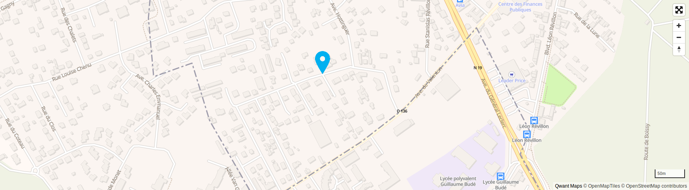

# Exemples d'intégration de la carte

Cette page référence des conseils utiles pour intégrer Qwant Maps dans différents produits.

## Instant Answer

*fond de carte non contractuel ;)*

Une page complète contenant cet exemple est disponible dans ce repo : `example_instant_answer.html`.

On considère que le géocodeur renvoie un geojson contenant
* les infos textuelles à afficher (pour le moment, juste une adresse. Plus tard surement des infos complémentaires)
* les coordonnées du point à afficher
* une information sur le niveau de zoom à afficher (une bbox, ou directement un niveau de zoom)


#### Dépendances
La lib MapboxGL est recommandée pour afficher les cartes.
La dernière version testée de notre côté est la version v0.41.0
```
  <script src='https://api.tiles.mapbox.com/mapbox-gl-js/v0.41.0/mapbox-gl.js'></script>
  <link href='https://api.tiles.mapbox.com/mapbox-gl-js/v0.41.0/mapbox-gl.css' rel='stylesheet' />
```

#### Chargement de la carte
Une div doit être définie dans le HTML pour l'affichage de la carte, traditionnellement, avec l'id `map`.
Puis, on peut instancier la carte avec mapbox gl.
Le style à utiliser est le style généraliste Qwants Maps.
```
    var map = new mapboxgl.Map({
      container: 'map',
      style: 'qwant_style.json',
      zoom: 10,
      center: geocoder_geojson['features'][0]['geometry']['coordinates']
    });
```

#### Définition des contrôles de la carte
Les contrôles de navigation (zoom) sont indispensable.
Le plein écran peut être intéressant pour l'utilisation en instant answer.
```
    map.addControl(new mapboxgl.FullscreenControl());
    map.addControl(new mapboxgl.NavigationControl());
```

#### Affichage du marqueur
L'affichage d'un point géographique issu d'un geojson se fait simplement avec mapbox GL.
Le centre du marqueur sera utilisé par défaut pour le positionnement. Pour un marqueur de type pin, ne pas oublier d'ajouter une option `icon-anchor`.
```
        map.addLayer({
          "id": "points",
          "type": "symbol",
          "source": {
            "type": "geojson",
            "data": geocoder_geojson
          },
          "layout": {
            "icon-image": "marker",
            "icon-anchor": "bottom",
            "icon-size": 0.25
          }
        });
```

Si le niveau de zoom n'a pas été défini à l'instanciation de la carte, il est nécessaire de l'ajuster.
Si on dispose d'une bbox :
```
      map.fitBounds(geocoder_geojson['features'][0]['properties']['bbox'], {
        padding: {
          top: 10,
          bottom: 25,
          left: 15,
          right: 5
        }
      });
```


## Liens utiles

* documentation de l'API Mapbox GL : https://www.mapbox.com/mapbox-gl-js/api
* documentation du style Mapbox GL (pour affiner le style du marqueur) : https://www.mapbox.com/mapbox-gl-js/style-spec
