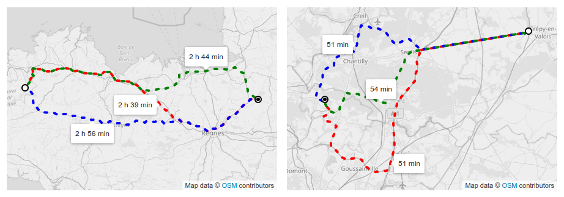

# alt-route-labeller

A library to compute the best position to put labels on multiple routes between two points.



 - [Showcase page](https://bbecquet.github.io/alt-route-labeller/examples/).
 - [In-depth explanation](https://bbecquet.net/articles/2020/12/labelling-alternative-routes/) as a blog article.

## Installation

Depending on your package manager:

`npm install --save alt-route-labeller`

or

`yarn add alt-route-labeller`

## Usage

The lib exposes the `getLabelPositions` function.

### Parameters

 * **`routes`**: the multiple routes to apply the labelling to. Can be expressed as a GeoJSON [FeatureCollection](https://datatracker.ietf.org/doc/html/rfc7946#section-3.3), an array of [Feature](https://datatracker.ietf.org/doc/html/rfc7946#section-3.2) objects, or an array of [Geometry](https://datatracker.ietf.org/doc/html/rfc7946#section-3.1) objects.

### Return value

An array of label positions, one for each of the routes, in the same order as they where passed to the function.

Each label position has the following properties:

  * **`lngLat`**: the best position of the label on the route, put on a non-ambiguous section not shared with other routes (if one can be found, otherwise fallback on the route middle position).
  * **`anchor`**: a hint value to minimize collisions if we want to display labels. Possible values: `top`|`bottom`|`left`|`right`. Inspired by the `anchor` property of [MapBox-GL-JS markers](https://docs.mapbox.com/mapbox-gl-js/api/markers/#marker).

## Example

```js
import { getLabelPositions } from 'alt-route-labeller';

const routes = getGeoJSONRoutesFromSomewhere();
const labels = getLabelPositions(routes);
labels.forEach(label => {
  createMarkerOnMap(label.lngLat, { anchor: label.anchor });
});

```
